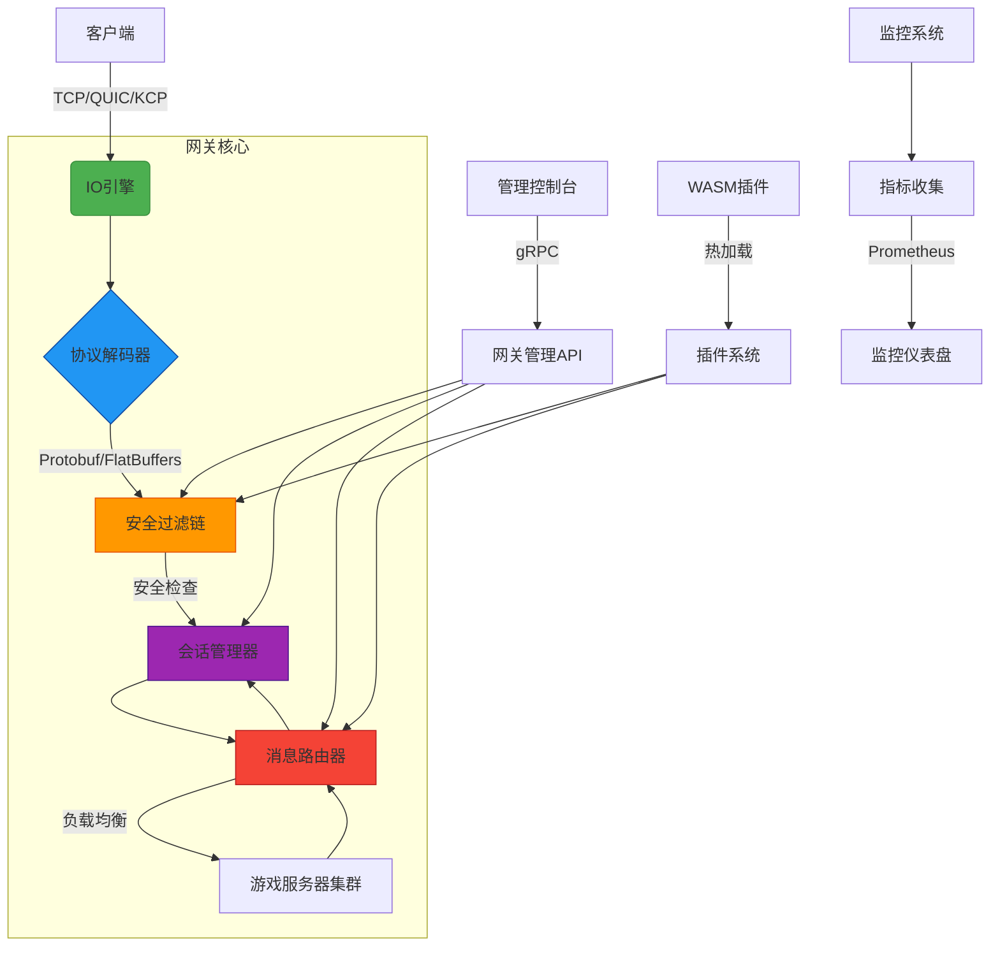
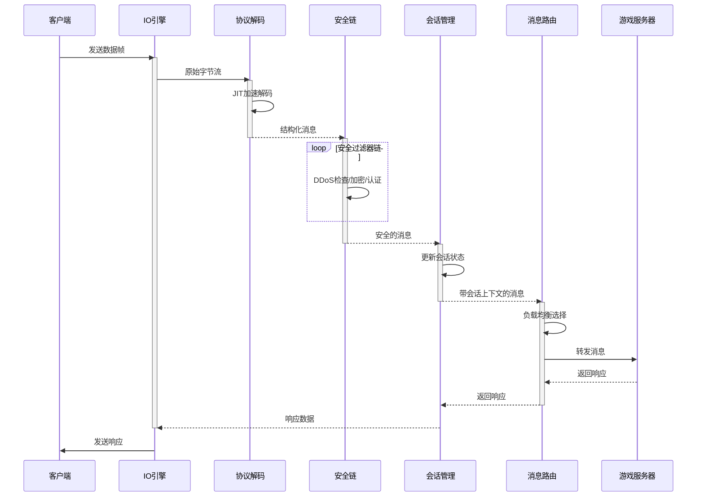
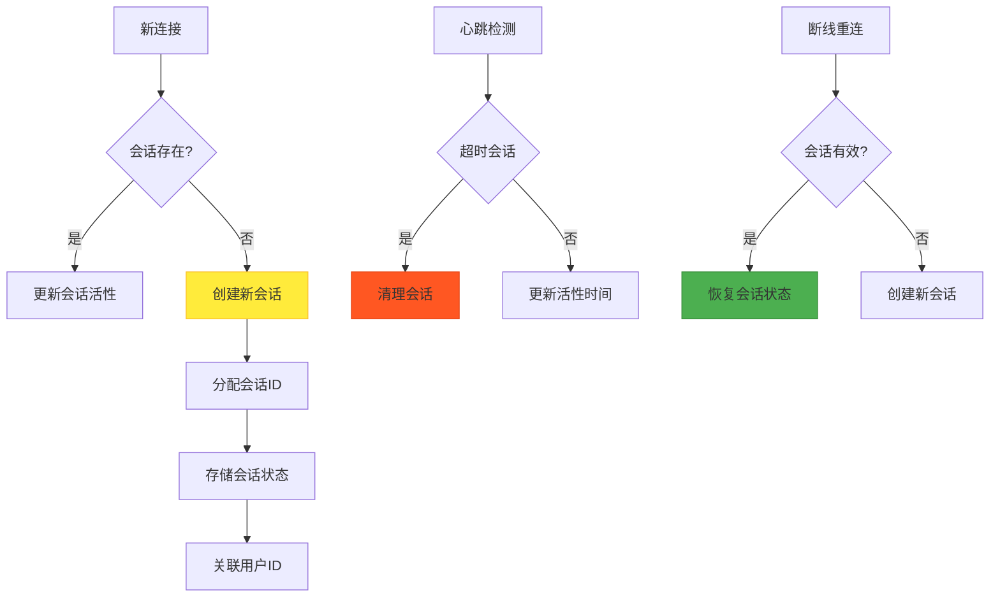
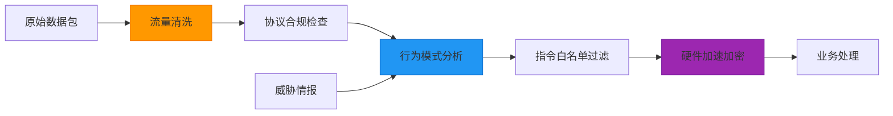
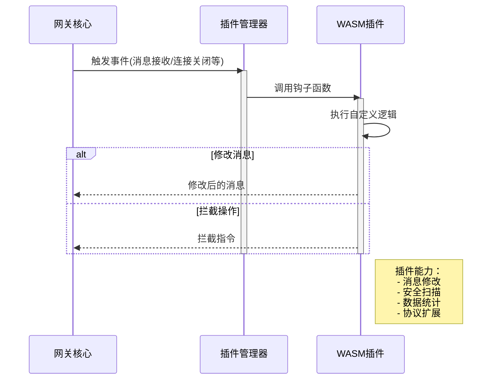
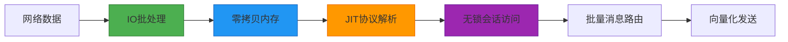

## 系统架构图

```mermaid
graph TD
    A[客户端] -->|TCP/QUIC/KCP| B(IO引擎)
    subgraph 网关核心
        B --> C{协议解码器}
        C -->|Protobuf/FlatBuffers| D[安全过滤链]
        D -->|安全检查| E[会话管理器]
        E --> F[消息路由器]
        F -->|负载均衡| G[游戏服务器集群]
        G --> F
        F --> E
    end
    
    H[管理控制台] -->|gRPC| I[网关管理API]
    I --> D
    I --> E
    I --> F
    
    J[WASM插件] -->|热加载| K[插件系统]
    K --> D
    K --> F
    
    L[监控系统] --> M[指标收集]
    M -->|Prometheus| N[监控仪表盘]
    
    style B fill:#4CAF50,stroke:#388E3C
    style C fill:#2196F3,stroke:#0D47A1
    style D fill:#FF9800,stroke:#E65100
    style E fill:#9C27B0,stroke:#4A148C
    style F fill:#F44336,stroke:#B71C1C
```
## 核心流程图
### 数据接收和发送

```mermaid
sequenceDiagram
    participant Client as 客户端
    participant IO as IO引擎
    participant Protocol as 协议解码
    participant Security as 安全链
    participant Session as 会话管理
    participant Router as 消息路由
    participant GameSvr as 游戏服务器
    
    Client->>IO: 发送数据帧
    activate IO
        IO->>Protocol: 原始字节流
        activate Protocol
            Protocol->>Protocol: JIT加速解码
            Protocol-->>Security: 结构化消息
        deactivate Protocol
        
        activate Security
            loop 安全过滤器链
                Security->>Security: DDoS检查/加密/认证
            end
            Security-->>Session: 安全的消息
        deactivate Security
        
        activate Session
            Session->>Session: 更新会话状态
            Session-->>Router: 带会话上下文的消息
        deactivate Session
        
        activate Router
            Router->>Router: 负载均衡选择
            Router->>GameSvr: 转发消息
            GameSvr-->>Router: 返回响应
            Router-->>Session: 返回响应
        deactivate Router
        
        Session-->>IO: 响应数据
    deactivate IO
    IO->>Client: 发送响应
```
### 会话管理流程

```mermaid
flowchart TD
    A[新连接] --> B{会话存在?}
    B -->|是| C[更新会话活性]
    B -->|否| D[创建新会话]
    D --> E[分配会话ID]
    E --> F[存储会话状态]
    F --> G[关联用户ID]

    H[心跳检测] --> I{超时会话}
    I -->|是| J[清理会话]
    I -->|否| K[更新活性时间]

    L[断线重连] --> M{会话有效?}
    M -->|是| N[恢复会话状态]
    M -->|否| O[创建新会话]

    style D fill:#FFEB3B,stroke:#FBC02D
    style J fill:#FF5722,stroke:#E64A19
    style N fill:#4CAF50,stroke:#388E3C
```
### 安全过滤链流程

```mermaid
flowchart LR
    A[原始数据包] --> B[流量清洗]
    B --> C[协议合规检查]
    C --> D[行为模式分析]
    D --> E[指令白名单过滤]
    E --> F[硬件加速加密]
    F --> G[业务处理]
    
    style B fill:#FF9800,stroke:#F57C00
    style D fill:#2196F3,stroke:#1976D2
    style F fill:#9C27B0,stroke:#7B1FA2
    
    H[威胁情报] --> D
```
### 插件交互系统

```mermaid
sequenceDiagram
    participant Gateway as 网关核心
    participant PluginMgr as 插件管理器
    participant WASM as WASM插件
    
    Gateway->>PluginMgr: 触发事件(消息接收/连接关闭等)
    activate PluginMgr
        PluginMgr->>WASM: 调用钩子函数
        activate WASM
            WASM->>WASM: 执行自定义逻辑
            alt 修改消息
                WASM-->>Gateway: 修改后的消息
            else 拦截操作
                WASM-->>Gateway: 拦截指令
            end
        deactivate WASM
    deactivate PluginMgr
    
    Note right of WASM: 插件能力：<br/>- 消息修改<br/>- 安全扫描<br/>- 数据统计<br/>- 协议扩展
```
### 关键路径性能优化图

```mermaid
graph LR
    A[网络数据] --> B[IO批处理]
    B --> C[零拷贝内存]
    C --> D[JIT协议解析]
    D --> E[无锁会话访问]
    E --> F[批量消息路由]
    F --> G[向量化发送]
    
    style B fill:#4CAF50,stroke:#2E7D32
    style C fill:#2196F3,stroke:#1565C0
    style D fill:#FF9800,stroke:#EF6C00
    style E fill:#9C27B0,stroke:#6A1B9A
```